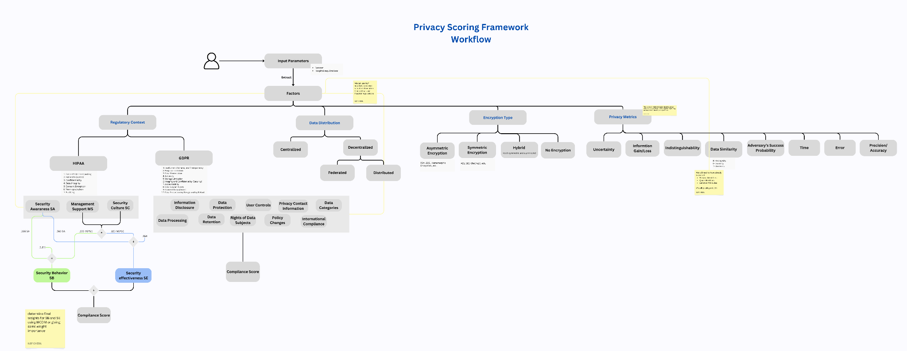

# Extracted PDF Content

### Page 1

# <strong>PriEval-Protect : Privacy Evaluation & Protection</strong>

# <strong>Framework</strong>

## <strong>Introduction</strong>

In the digital age of healthcare, privacy concerns have become increasingly critical due to the

widespread use of patient data in AI-driven applications and clinical decision-making

systems. Hospitals, research institutions, and health-tech companies must implement robust

data protection mechanisms to comply with stringent regulations such as the GDPR and

HIPAA, while also upholding ethical standards and patient trust  [1] [2] . However, existing

approaches often address privacy in a fragmented manner—focusing either on compliance

scoring, risk estimation, or anonymization techniques in isolation. This siloed perspective

leads to limited scalability and adaptability across diverse healthcare data environments.

To address this gap, <strong>PriEval-Protect</strong> introduces a comprehensive and unified framework that

integrates Privacy Scoring and Privacy Solutions to systematically assess and enhance data

privacy. The Privacy Scoring phase quantifies privacy risk using a multi-factor model that

incorporates regulatory context (e.g., HIPAA, GDPR compliance)  [2] [1] , data distribution

structure (centralized vs. decentralized) [3] [4] , encryption types (symmetric, asymmetric,

homomorphic) [5], and privacy metrics such as uncertainty, information gain/loss, i

indistinguishability, adversary success rate, time, and error [6]. The scoring is based on a

customizable weighted formula that adjusts according to the dataset characteristics and

applicable regulatory standards.

Following risk assessment, the Privacy Solutions phase recommends tailored

privacy-preserving techniques. This includes prioritizing Federated Learning (FL) to support

decentralized model training without exposing raw data [4], and Differential Privacy (DP) to

introduce mathematically controlled noise that prevents individual data points from being

identifiable [4] —all while maintaining high analytical accuracy.

While prior research has explored privacy metric taxonomies [6], GDPR/ HIPAA compliance

scoring models [2] [1], and risk formulas for open data scenarios [7], they lack an integrated,

automated decision-making system that considers all relevant privacy dimensions and

translates scores into actionable protection strategies.

By unifying risk quantification and privacy-enhancing solutions, PriEval-Protect offers a

scalable, adaptable, and practical solution for healthcare stakeholders—enabling them to meet

compliance goals, reduce privacy risks, and preserve data utility.

## <strong>State of Art</strong>

## <strong>I.</strong>

## <strong>Privacy Scoring :</strong>

Informed by insights from existing literature and practical frameworks, we propose a unified

workflow for evaluating privacy in e-health datasets. Our goal is to compute a <strong>composite</strong>

<strong>privacy score</strong> by integrating diverse but complementary factors.

The core factors considered in this model include:

### Page 2

<strong>1) Regulatory Context  :</strong>

<strong>a. HIPAA: [1], [8]</strong>

The authors outlined HIPAA’s privacy and security requirements to safeguard electronic

health data, ultimately identifying seven core principles that characterize HIPAA compliance.

[8]

The authors conducted an in-depth analysis of compliance factors influencing HIPAA

adoption. Their research identified key determinants such as: [1]

● <strong>Security Awareness SA</strong> – The extent to which employees understand and follow

security policies.

● <strong>Management Support MS</strong> – The role of executive leadership in promoting HIPAA

adherence.

● <strong>Security Culture</strong> <strong>SC</strong> – The ingrained values and attitudes toward compliance within

an institution.

● <strong>Security Behavior SB</strong> – How security training influences daily data handling

practices.

● <strong>Security Effectiveness</strong> <strong>SE</strong> – The ability of HIPAA measures to prevent unauthorized

access and breaches.

These factors were integrated into a weighted compliance model, where Security Awareness,

Management Support, and Security Culture contribute to Security Behavior and Security

Effectiveness. The final compliance score reflects how well an institution adheres to HIPAA

mandates.

Integration in our workflow: [1]

figure 1. The empirically-validated conceptual model of the relevant factors and their effects

on HIPAA security compliance in AMCs. [1]

SE and SB formulas: [1]

SE = .864 + .569*SA  + .320*MS x SC

SB = 3.311 + .265*SA +.255*MS x SC

### Page 3

Limits:

● The article misses how to actually extract influencing factors (like awareness or

support) from policies and regulations, making the evaluation non-automated and

hard to scale.

● Surveys, while useful, are biased and manual—they can’t be fully trusted or

automated for large-scale compliance checks.

<strong>b. GDPR: [2]</strong>

The authors proposed and validated the <strong>Benjumea Privacy Scale</strong> , a robust GDPR-based tool

to evaluate the quality of privacy policies in mHealth applications. The scale was developed

using a two-round eDelphi study with privacy experts, refining a previous checklist of <strong>14</strong>

<strong>GDPR-derived</strong> items. They added two new items and assigned weights to each based on

expert consensus using Likert scale scoring and IQR analysis. The final weighted scale helps

measure how clearly and completely privacy policies inform users about data processing,

rights, and legal obligations.

<strong>Key contributions</strong> :

● Validation of 14 core GDPR-based items

● Addition of 2 expert-suggested items

● Weighted scoring (1 or 0.5) to reflect perceived importance

● Final scale provides a transparent, measurable method to assess privacy compliance in

mHealth apps

Integration in our workflow:

● We can incorporate the Benjumea scale’s items and weights directly into our privacy

policy scoring tool to assess textual GDPR compliance.

● The scale’s item definitions can guide our feature extraction from policies (e.g., legal

basis, data retention, user rights).

GDPR compliance formula: [2]

𝐺𝐶𝑆 = Σ 𝑊?𝑖 * 𝑊𝑖

Σ 𝑊𝑖

×  100

With Xi the items from tables below and Wi weights L1=1 or L2=0.5 depending on the

factor.

Xi values come from assessing whether a specific GDPR-required element is present in a

privacy policy. Values are: 0 missing or non-compliant , 0.5 partially compliant, 1 fully

present and compliant.

Note: we can find a detailed description of each item in the article.

### Page 4

figure 2. derived GDPR-items and weights to calculate compliance score. [2]

| HIPAA | GDPR |
|---|---|
| ● The article does not provide an
automated method or algorithm for
extracting the presence and
compliance of Xi | ● The study only focuses on GDPR
compliance and does not address
other global privacy regulations like
HIPAA, CCPA, or other
sector-specific laws to estimate a
general privacy score. |
Limits:

● The article does not provide an automated method or algorithm for extracting the

presence and compliance of Xi  (items) in privacy policies. Instead, it describes a

manual expert-driven evaluation process using a checklist-based assessment.

● The study only focuses on GDPR compliance and does not address other global

privacy regulations like HIPAA, CCPA, or other sector-specific laws to estimate a

general privacy score.

HIPAA

GDPR

● The article does not provide an

● The study only focuses on GDPR

automated method or algorithm for

extracting the presence and

compliance of Xi

compliance and does not address

other global privacy regulations like

HIPAA, CCPA, or other

sector-specific laws to estimate a

general privacy score.

### Page 5

<strong>2) Data distribution : [3], [4]</strong>

| encyrption | type | presence | degree | effect on
privacy |
|---|---|---|---|---|
|  | Symmetric | 1 | 80% | 70% |
|  | Asymmetric | 0 | 60% | 100% |
From multiple literature sources we can conclude that data distribution significantly affects

privacy, security, and compliance in healthcare systems. Different studies highlight its role in

privacy risk management.

The authors of the first article  [3] show that centralized architectures offer simplicity and

integration benefits but pose higher privacy risks due to single points of failure, whereas

decentralized systems enhance resilience and privacy by distributing data across multiple

nodes.

The second article [4] emphasizes that federated learning leverages decentralized data

distribution to preserve patient privacy, with privacy-enhancing techniques like differential

privacy and homomorphic encryption mitigating risks during model training.

Integration in our workflow:  [3], [4]

● Centralized vs. decentralized classification helps in scoring data exposure and

integration complexity.

● Privacy trade-offs: Helps calibrate weights in our privacy scoring model (e.g.,

decentralized systems are resilient but harder to integrate).

Limits:

● Both articles highlight the critical role of data distribution (centralized vs.

decentralized) in influencing privacy, security, and compliance, but fail to provide a

concrete method or formula to quantify its impact in a privacy score — leaving a gap

that we aim to address through structured weighting using <strong>MCDM techniques</strong> like

AHP to assign weights based on expert judgment. [9]

<strong>3)</strong> <strong>Encryption Type</strong> <strong>:</strong> <strong>[5]</strong>

encyrption

type

presence

degree

effect on

privacy

Symmetric

1

80%

70%

Asymmetric

0

60%

100%

Table. encryption types effects on privacy

The authors of [5] proposed and implemented a hybrid encryption algorithm that combines

an optimized version of AES (called P-AES) (symmetric) with RSA (asymmetric) to improve

the security and efficiency of medical data storage in cloud databases. The work is motivated

by the challenge of protecting sensitive patient data while enabling high-performance access

and storage in hospital systems.

### Page 6

They modified the AES algorithm into a parallel version (P-AES) to handle large medical

records more efficiently. This was then paired with RSA to secure key exchange, forming a

hybrid model.

The approach was tested in a hospital information management system, and results

demonstrated faster encryption/decryption, good scalability with long data, and resilience

against typical cryptographic attacks.

<strong>key findings: [5]</strong>

● AES and outer-layer database encryption showed high encryption/decryption

efficiency.

● The hybrid encryption algorithm (P-AES + RSA) effectively protects medical data in

cloud databases and enhances patient privacy.

Integration in our workflow:

We can conclude from literature that hybrid encryption deserves the highest score because it

protects both data and key confidentiality.

No encryption should be penalized in the scoring as it introduces high privacy risk.

This also aligns with GDPR [10] and HIPAA [11] expectations on secure storage and

transmission.

Limits:

● Limitations of P-AES: It currently supports only text data, not images or multimedia,

and is restricted to AES-128 (128-bit keys only). There remains significant potential

for improvement.

● While highlighting the importance of encryption, the article did not provide

quantitative weights or formal scoring methods for comparing encryption types —

leaving a gap that we aim to address through structured weighting using <strong>MCDM</strong>

<strong>techniques</strong> like AHP to assign weights based on expert judgment. [9]

<strong>4)</strong> <strong>Privacy metrics:</strong> <strong>[6]</strong>

The authors conducted a  systematic survey  of over <strong>80</strong> technical <strong>privacy metrics</strong> to bring

structure to a fragmented landscape. The authors reviewed these metrics across multiple

privacy domains (databases, communication systems, social networks, etc.) and introduced a

<strong>taxonomy</strong> based on:

- What aspect of privacy the metric measures

- The  inputs  required

- The  type of data  involved

-  Output characteristics  (e.g., uncertainty, indistinguishability, information gain/loss)

### Page 7

They also proposed a  framework of nine guiding questions  to help choose appropriate

metrics for different scenarios.

<strong>Key findings :</strong>

- Privacy is multidimensional— no single metric  can capture all aspects and the need

for  multi-metric evaluation  is critical to avoid bias.

- The authors classified metrics into  8 output categories :

1. Uncertainty

2. Information gain/loss

3. Data similarity

4. Indistinguishability

5. Adversary's success probability

6. Error

7. Time

8. Accuracy/Precision

Integration in our workflow :

● The  taxonomy  can guide which metrics to use when calculating privacy scores

across regulatory contexts (GDPR, HIPAA).

● Supports the use of  multi-criteria decision-making (AHP)  by emphasizing

non-uniform importance  of metrics.

### Page 8

figure 3. Taxonomy of privacy metrics, classified by output [6]

Limits :

● Does  not assign numerical weights  or practical prioritizations (we will complement

it with AHP model). [9]

● Many metrics are domain-specific—may require  adaptation  to work well in

medical/e-health data but we notice the presence of genome security which might be

the closest to the healthcare domain .

● Limited tool support or validated implementations: lack of mentioned libraries or

specific implementations.

⇒ To operationalize our framework, we will leverage tools like PyCANON  [12] for

computing technical metrics such as k-anonymity, l-diversity, and t-closeness . However,

accurate calculation of these metrics depends on the correct identification of quasi-identifiers

(QIs) and sensitive attributes (SAs).

For this purpose, we will use Large Language Models (LLMs) to extract and classify

attributes from datasets and schema documentation.

❖ <strong>LLMs use justification: [13]</strong>

The author conducted a comprehensive study exploring automated quasi-identifier (QID)

recognition using multiple techniques, including deep learning, causal inference, and

heuristic optimization. The work introduced several architectures and approaches, aiming to

overcome the limitations of traditional privacy protection methods, particularly for

identifying QIDs in tabular datasets. They worked with diverse datasets, both medical

(heart+disease , diabetes) and non medical (adult, nursery and car).

Table 1. Summary of Research Directions for QID Recognition [13]

<strong>Key findings :</strong>

- <strong>Mutant Autoencoder</strong> : Designed to detect QIDs via weight convergence, but was

unstable and partially abandoned.

### Page 9

- <strong>CustomLossDNN</strong> : A deep neural network with a custom loss function

combining distinction, separation, and k-anonymity. Conceptually strong but limited by

complex backpropagation and computational inefficiency.

- <strong>Evolutionary Algorithm</strong> : Explored QID combinations using fitness functions.

Results were good, but the method was costly (70+ hours), lacked causal modeling, and had

low explainability.

- <strong>CVAE_GAN_IFE</strong> : The most advanced approach combining causal discovery,

VAE-GAN reconstruction, and isolation forest ensemble for QID detection. Outperformed

ground truth in most datasets but was limited to QIDs (not SAs), computationally intensive,

and unaware of regulatory requirements.

- <strong>LLM Experiment</strong> : A Large Language Model from Perplexity.ai [14] was tested

for classifying QIDs, SAs, and NSAs using different levels of context. Performance improved

with better prompt design, showing the potential of prompt engineering in enhancing attribute

classification.

We chose to integrate LLMs because:

⇒

● Traditional approaches are often limited to quasi-identifier detection only, lack

support for identifying sensitive attributes, and require high computational resources or

manual effort.

● LLMs offer a scalable, lightweight, and context-aware solution that can classify QIDs,

SAs, and NSAs directly from data and documentation—making them ideal for our goal of

automating privacy risk assessment across diverse healthcare datasets.

Detailed key findings for the LLM approach :

● The LLM Perplexity.ai [14] was tested on the dataset, using known ground-truth

labels for QIDs, SAs, and NSAs.

● It was evaluated under three levels of context:

1. Attribute list only

2. Reference to the Adult dataset with attribute list

3. Full dataset upload with attribute list

● Performance improved with increased context, as measured by the Jaccard index ,

confirming the value of contextual input.

● The LLM was able to correctly predict QIDs, SAs, and NSAs, showing strong

potential for automation in early-stage attribute classification.

● This experiment also revealed that prompt engineering is a key lever for improving

LLM performance in privacy-related tasks.

Table 2. Jaccard Indexes for QIDs, SAs, and NSAs [13]

### Page 10

Integration in our workflow :

● LLMs will be used in the <strong>preprocessing phase</strong> of our framework to automatically

classify QIDs, SAs, and NSAs. This classification will enable precise metric

computation via tools like PyCANON (k-anonymity, l-diversity, t-closeness).

● Using prompt engineering techniques, we can adapt the LLMs to various data types

and context, improving flexibility and reducing manual workload.

Limits :

● Current LLMs <strong>rely heavily on well-crafted prompts</strong> ; poor prompt design may yield

suboptimal results.

● The use of external LLM platforms raises <strong>data confidentiality concerns</strong> , particularly

in sensitive domains like healthcare. To address this, we can either self-host the LLMs

in secure environments or, when using external APIs, strictly limit input to

schema-level data (e.g., attribute names only). Techniques like few-shot prompt

engineering can be used to guide the model effectively without exposing real data,

ensuring both utility and privacy.

❖ <strong>Diagram : Privacy Framework workflow</strong>

figure 4. PriEval-Protect Privacy Scoring Workflow

-> Please navigate to this link for a clearer view.

<strong>Description:</strong>

The Privacy Scoring Framework Workflow diagram visually encapsulates the multi-phase

logic of the PriEval-Protect framework, which systematically assesses privacy risks in

e-health datasets. At its core, the diagram integrates four foundational

components— <strong>regulatory context</strong> , <strong>data distribution</strong> , <strong>encryption type</strong> , and <strong>privacy</strong>

<strong>metrics</strong> —to calculate a composite privacy score.

### Page 11

The regulatory context branch incorporates both GDPR and HIPAA, using validated scoring

models like the Benjumea Privacy Scale and the HIPAA compliance formulas based on

Security Behavior (SB) and Security Effectiveness (SE). These scores are influenced by

institutional factors such as awareness, management support, and security culture.

The data distribution component distinguishes between centralized and decentralized

architectures (federated /distributed), which affect exposure risk and compliance feasibility.

Encryption types are categorized into symmetric, asymmetric, hybrid, or none, with hybrid

earning the highest weight due to its resilience and efficiency.

The privacy metrics section includes technical indicators like k-anonymity, l-diversity,

t-closeness, differential privacy, indistinguishability, and adversary success

probability—essential for quantifying re-identification risk and information leakage.

Multi-Criteria Decision Making (MCDM) techniques like AHP are used to assign weights

across all factors, ensuring flexibility based on context.

Natural Language Processing (NLP) and Large Language Models (LLMs) to automate the

extraction of key information from unstructured inputs such as hospital privacy policies,

regulatory documents, and dataset metadata.

This diagram not only guides the risk quantification process but also lays the foundation for

recommending tailored Privacy Solutions .

## <strong>II.</strong>

## <strong>Privacy Solutions : (upcoming work, more research will be</strong>

## <strong>conducted once phase 1 is done): [4]</strong>

### Page 12

<strong>References:</strong>

https://estudogeral.uc.pt/handle/10316/118106

[1] J. W. Brady, “Securing Health Care: Assessing Factors That Affect HIPAA Security

Compliance in Academic Medical Centers,” in 2011 44th Hawaii International

Conference on System Sciences , Jan. 2011, pp. 1–10. doi: 10.1109/HICSS.2011.368.

[2] “A Proposal for a Robust Validated Weighted General Data Protection

Regulation-Based Scale to Assess the Quality of Privacy Policies of Mobile Health

Applications: An eDelphi Study - PubMed.” Accessed: Mar. 21, 2025. [Online]. Available:

https://pubmed.ncbi.nlm.nih.gov/37591261/

[3] M. Abughazalah, W. Alsaggaf, S. Saifuddin, and S. Sarhan, “Centralized vs.

Decentralized Cloud Computing in Healthcare,” Appl. Sci. , vol. 14, no. 17, Art. no. 17,

Jan. 2024, doi: 10.3390/app14177765.

[4] X. Gu, F. Sabrina, Z. Fan, and S. Sohail, “A Review of Privacy Enhancement

Methods for Federated Learning in Healthcare Systems,” Int. J. Environ. Res. Public.

Health , vol. 20, no. 15, Art. no. 15, Jan. 2023, doi: 10.3390/ijerph20156539.

[5] F. Zhang, Y. Chen, W. Meng, and Q. Wu, “Hybrid Encryption Algorithms for Medical

Data Storage Security in Cloud Database,” Feb. 28, 2019, Social Science Research

Network, Rochester, NY : 3388492. Accessed: Mar. 21, 2025. [Online]. Available:

https://papers.ssrn.com/abstract=3388492

[6] I. Wagner and D. Eckhoff, “Technical Privacy Metrics: A Systematic Survey,” ACM

Comput Surv , vol. 51, no. 3, p. 57:1-57:38, Jun. 2018, doi: 10.1145/3168389.

[7] A. Ali-Eldin, A. Zuiderwijk, and M. Janssen, “A Privacy Risk Assessment Model for

Open Data,” in Business Modeling and Software Design , B. Shishkov, Ed., Cham:

Springer International Publishing, 2018, pp. 186–201. doi:

10.1007/978-3-319-78428-1_10.

[8] H. S. Gardiyawasam Pussewalage and V. A. Oleshchuk, “Privacy preserving

mechanisms for enforcing security and privacy requirements in E-health solutions,” Int.

### Page 13

J. Inf. Manag. , vol. 36, no. 6, Part B, pp. 1161–1173, Dec. 2016, doi:

10.1016/j.ijinfomgt.2016.07.006.

[9] “Multi-Criteria Decision Making (MCDM) Methods and Concepts.” Accessed: Mar. 21,

2025. [Online]. Available: https://www.mdpi.com/2673-8392/3/1/6

[10]

“Art. 32 GDPR – Security of processing,” General Data Protection Regulation

(GDPR). Accessed: Mar. 22, 2025. [Online]. Available: https://gdpr-info.eu/art-32-gdpr/

[11]

S. Alder, “HIPAA Encryption Requirements - 2025 Update,” The HIPAA

Journal. Accessed: Mar. 22, 2025. [Online]. Available:

https://www.hipaajournal.com/hipaa-encryption-requirements/

[12]

J. Sáinz-Pardo Díaz and Á. López García, “A Python library to check the level

of anonymity of a dataset,” Sci. Data , vol. 9, no. 1, p. 785, Dec. 2022, doi:

10.1038/s41597-022-01894-2.

[13]

S. A. Simões, “Automated Data Privacy Protection using Deep Learning and

Causality Techniques,” in Automated Data Privacy Protection using Deep Learning and

Causality Techniques , Sep. 2024. Accessed: Mar. 23, 2025. [Online]. Available:

https://estudogeral.uc.pt/handle/10316/118106

[14]

“Perplexity,” Perplexity AI. Accessed: Mar. 23, 2025. [Online]. Available:

https://www.perplexity.ai

Proposer un nom pour votre approche

<strong>Introduction</strong>

// là vous allez parler du contexte + problématique + objectifs

(une page max) avec à chaque fois vous intégrez des références à des travaux existants qui ont traité le

même contexte et la même problématique

<strong>Etat de l’art</strong>

// cette partie sera divisée en deux sous parties :

-

la première sera consacrée aux travaux de recherche existants pour la classification des

attributs (LLM et autre) finir par un tableau qui montre les limites des approches trouvées

-

la seconde traite les travaux étudiés pour faire l’organigramme

NB: N’oubliez pas d’ajouter les références des articles lus à chaque fois

### Page 14

